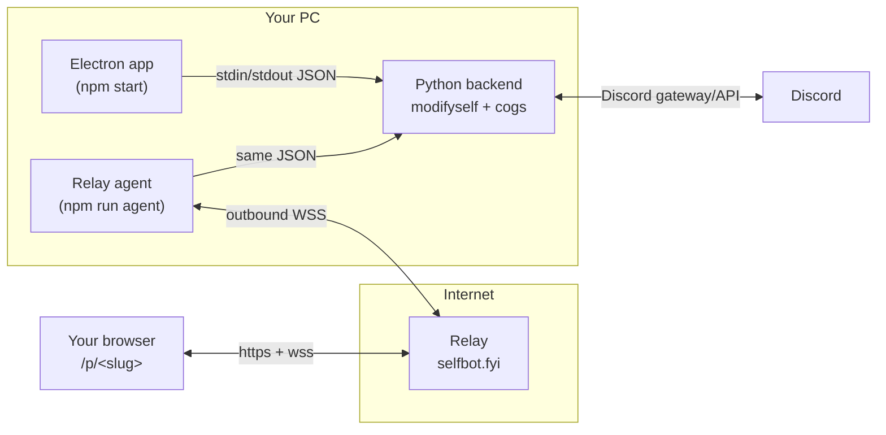

<div align="center">


# Beyond

**A Discord selfbot control panel — desktop app + self-hosted web dashboard.**

Dot-prefix (`.`) commands and slash (`/`) commands, a rich RPC engine, Spotify
now-playing, a live message logger, profile editing, and a remote web panel you
host from your own PC.

<br/>


</div>

---

> [!WARNING]
> Automating a **user** account ("selfbotting") breaks Discord's Terms of
> Service and can get the account banned. Use an account you're willing to lose.
> This project is for education and personal use.

---

## ✨ What is Beyond?

Beyond is a control panel for a Discord **selfbot**. **Electron is only the UI
shell** — the real engine is **Python + [modifyself](https://github.com/kzfq/modifyself)**,
which the app launches as a child process. Node never talks to Discord;
everything Discord goes through Python.

You can drive it two ways, over the **same backend**:

| | |
|---|---|
| 🖥️ **Desktop app** | `npm start` — a native window on your PC. |
| 🌐 **Remote web panel** | `npm run agent` — host a private, password-locked dashboard from your PC and open it from any browser (even your phone). |

## 🧩 Features

- **Dashboard** — account overview, real badges (`public_flags`), Nitro, server/friend counts, live uptime & command counter.
- **RPC engine** — playing / listening / watching / streaming / competing, Spotify, YouTube, Xbox, PlayStation, Crunchyroll, **VRChat spoof**, custom & custom-status; presets, rotation, activity stacking, platform / multi-platform spoofing, image uploads.
- **Spotify** — live now-playing with synced lyrics streamed to the UI.
- **Message Logger** — track keywords & mentions across everything, capture **deleted & edited** messages, scope to everywhere / DMs / a server / a channel, with a live feed.
- **Profile** — set display name, avatar, banner, bio, pronouns and accent colour from a live-preview card.
- **Discoverable** — one toggle puts up a "Using Beyond Selfbot" VRChat presence with a *get it now* button linking back here.
- **Slash mirror** — every tab's actions are also `/` slash commands (user-installed, work in DMs and any server).

## 🏗️ Architecture



The web panel is a **remote window** into the backend on your PC. The relay only
shuttles JSON — it never touches Discord. Close your PC and the panel goes
offline.

## 🚀 Quick start (desktop app)

**Requirements:** Python 3.10+ and Node 18+.

```bash
# 1) clone
git clone https://github.com/kzfq/beyond
cd beyond

# 2) backend deps
pip install -r backend/requirements.txt

# 3) run the desktop app
npm install
npm start
```

Paste your account token on the login screen. **Remember me** stores it in
Electron's userData (never in this folder).

## 🌐 Remote web panel (multi-tenant, self-hosted)

Every install gets its **own unguessable link + its own password**. On first run
the app generates a 256-bit identity and a strong password, enrolls with the
relay, gets a random `slug`, and saves it locally so your link stays the same.
The relay stores only **Argon2id hashes** — never plaintext.

**1.** Copy the sample config and add your relay's enrollment key:

```bash
cp backend/agent_config.example.json backend/agent_config.json
```
```jsonc
{
  "relay_base": "https://agent.selfbot.fyi",
  "viewer_base": "https://selfbot.fyi",
  "enroll_key": "<BEYOND_ENROLL_KEY from the relay>"
  // slug / agent_secret / viewer_password fill in automatically
}
```

**2.** Start the agent:

```bash
npm run agent        # macOS/Linux
npm run agent:win    # Windows
```

**3.** It prints your panel:

```
============================================================
  Your Beyond panel:
    Link:     https://selfbot.fyi/p/<your-slug>
    Password: xxxx-xxxx-xxxx-xxxx
============================================================
```

Open the link, enter the password — full dashboard, driving the selfbot on your
PC. `.` and `/` commands keep working in parallel.

> [!NOTE]
> The relay (VPS) side must be running the multi-tenant build. The exact
> server spec + Cloudflare setup is in [`RELAY_PROMPT.md`](RELAY_PROMPT.md).

## 💬 Commands

Prefix is `.` by default (set `BEYOND_PREFIX`). Everything is also a `/` command.

| Area | Commands |
|------|----------|
| **Core** | `.help` · `.ping` · `.stats` |
| **Presence** | `.rpc <type> …` · `.status <online\|idle\|dnd\|invisible>` · `.platform <vr\|phone\|…>` |
| **RPC extras** | `.rpc preset` · `.rpc rotation` · `.rpc stack` · `.multiplatform` |
| **Logger** | `.msglog` (aliases `.logger`, `.mlog`) |
| **Profile** | `.setpfp` · `.setbanner` · `.setbio` · `.setpronouns` · `.setdisplayname` · `.setaccent` · `.profile` |
| **Slash** | `/rpc` · `/logger` · `/profile` |

## 🗂️ Project layout

```
beyond/
├── main.js              Electron shell: window + spawns/relays the Python backend
├── preload.js           safe IPC bridge (desktop)
├── package.json
├── renderer/            the UI (index.html, styles.css, app.js) + web-shim.js
└── backend/
    ├── beyond_backend.py  engine: login, stats, RPC, slash bot, IPC dispatch
    ├── beyond_agent.py    relay agent: enroll + bridge the UI to selfbot.fyi
    ├── rpc_cog.py         full RPC/presence engine
    ├── spotify_cog.py     now-playing + lyrics
    ├── logger_cog.py      keyword/mention/delete/edit logger
    ├── profile_cog.py     avatar/banner/bio/pronouns/accent
    └── requirements.txt
```

## 🔐 Security

- The web link is a **capability** (128-bit random slug) + an app-generated
  password; the relay stores only salted **Argon2id** hashes.
- A per-install 256-bit `agent_secret` (kept only on your PC) owns your slug.
- Tenants are fully isolated; logins are rate-limited and locked out on abuse.
- `backend/agent_config.json` holds your enrollment key and per-install secrets
  and is **gitignored** — never commit it. A safe template lives in
  `agent_config.example.json`.

## 📄 License

MIT — see the badge above. Not affiliated with Discord.
